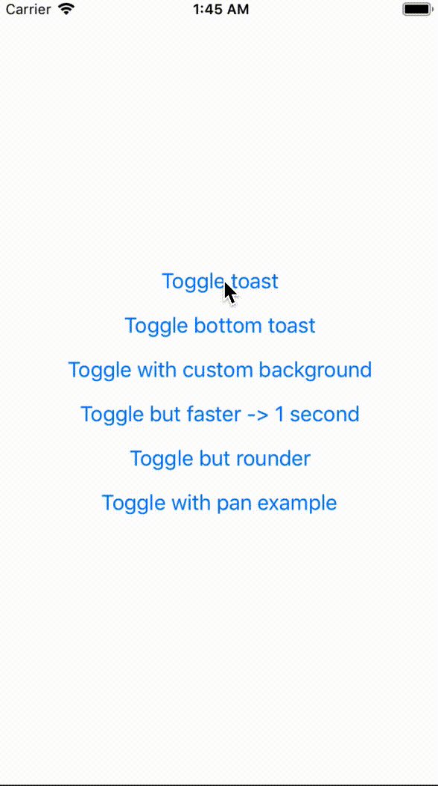

# React native toasting

A simple react native component for creating toasts / alerts . Something similar named [react-native-easy-toast]() does exist but it does not respond to touches meaning that the only difference between <code>rn-toast-alert</code> and <code>react-native-easy-toast</code> is that <code>rn-toast-alert</code> is using pan responder and the other one is not . It looks something like this after installing

<div style="text-align:center" ></div>

## Table of contents

- [Installation](#installation)
- [Usage](#usage)
- [Options](#options)

# Installation

```bash
npm install --save rn-toast-alert
OR
yarn add rn-toast-alert
```

# Usage

```javascript
import React from "react";
import { View, Text, Image } from "react-native";
import Toast from "rn-toast-alert";

class App extends React.Component {
  render() {
    return (
      <View>
        <Toast ref="toast" />
        <Button
          title="Toggle toast"
          onPress={() => {
            this.refs.toast.showToast("Toasting", {
              backgroundColor: "#000000",
              textColor: "#ffffff",
              duration: 1500,
              round: false,
              position: "top"
            });
          }}
        />
      </View>
    );
  }
}

export default App;
```

# Options

All of them are not required :)

| Props           |  Type   | default |                     Description                     |
| --------------- | :-----: | :-----: | :-------------------------------------------------: |
| backgroundColor | string  | #000000 |           Background color for the toast            |
| textColor       | string  | #000000 |                  Color of the text                  |
| duration        | number  |  2500   |          Time until the toast gets closed           |
| round           | boolean |  true   | Sets the border radius to 14 if true and 5 if false |
| customStyles    | object  |   {}    |                    Custom style                     |

> Created by Adib Mohsin . MIT license
